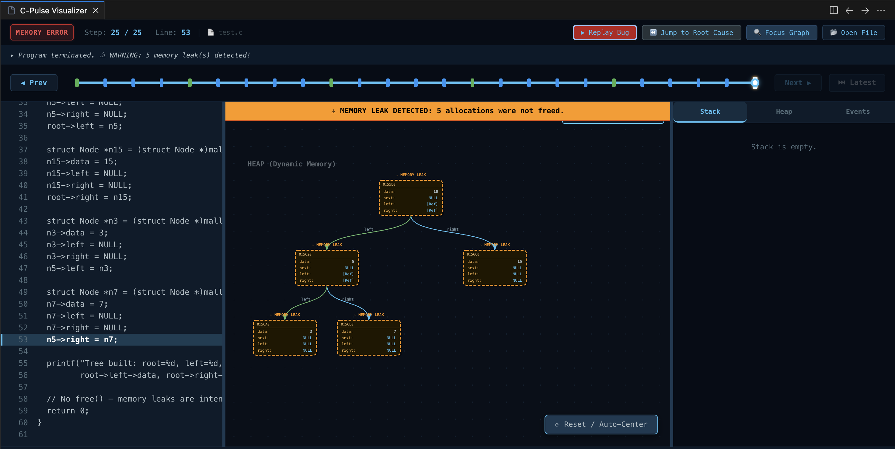
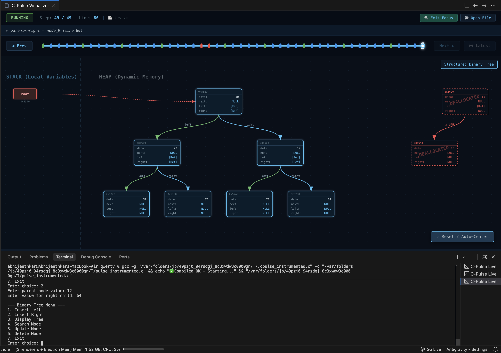
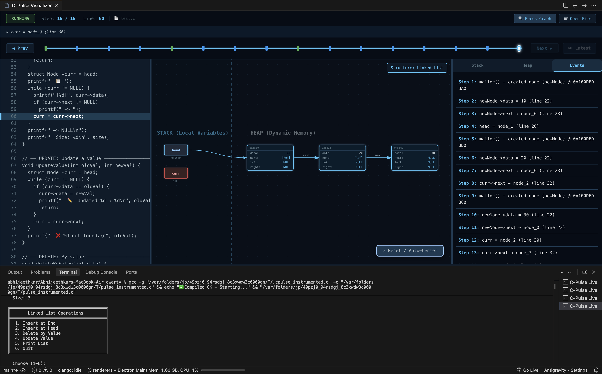
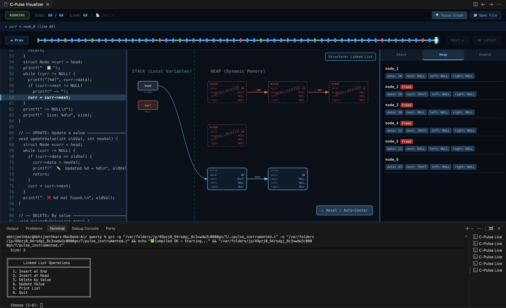

# C-Pulse 🧠

> A professional, interactive Visual Memory Debugger for C programming explicitly built as a VS Code extension. Watch pointers, stack variables, and heap allocations trace dynamically in real-time as your code executes!

[](https://code.visualstudio.com/)
[](https://react.dev/)
[](https://www.typescriptlang.org/)
[](LICENSE)
[](#)

---

## 🚀 Screenshots

  
*(The main UI features synchronized code execution, stack/heap boundaries, and real-time inspector layers.)*

  
*(Interactive timeline scrubbing and memory visualizations.)*

  
*(Visualizing complex pointer relationships and heap allocations.)*

  
*(Deep inspection of pointers, addresses, and data structures.)*

---

## ✨ Feature Overview

C-Pulse ships with an extensive set of tools to diagnose segmentation faults, trace complex graphs, and build an intuitive understanding of the absolute fundamentals of C program memory management.

| Feature Area | Capabilities |
| --- | --- |
| **Memory Visualization** | • Clear visual separation of the **Stack** and the **Heap** regions.<br>• Native runtime Heap node tracking.<br>• Bi-directional pointer relationship routing.<br>• Node hover inspector representing physical bytes and addresses.<br>• Intelligent auto-centering of complex node graphs. |
| **Execution & Debugging** | • Step-by-step instruction execution tracing.<br>• Modern interactive execution timeline scrubbing.<br>• Instant keyboard shortcuts for seamless navigation.<br>• Live, synchronized code view matching executing pointers line-by-line. |
| **Bug Detection Engine** | C-Pulse natively traps critical memory violations and marks them securely during execution:<br>• Memory Leaks<br>• Double Free<br>• Invalid Free<br>• Null Pointer Dereferences<br>• Use-After-Free Detection |
| **Educational Tooling** | • **Ghost Nodes**: Visually preserves `free()`'d memory to explain dangling pointers.<br>• **Bug Replay Mode**: Jump backwards into the exact source of a memory access violation automatically.<br>• Complete trace history tracked cleanly via the Event Log interface. |
| **Rich User Interface** | • Highly responsive resizable UI panels (`react-resizable-panels`).<br>• Powerful dedicated Inspectors for the Stack, Heap, Warnings, and Event logs.<br>• Focused fullscreen graph-only mode. |

---

## 🏗️ How it Works (Architecture)

1. **Instrumentation (GCC)**: C-Pulse uses a robust compiler-level code instrumenter. Standard source code is intelligently wrapped to hijack low-level `malloc`, `calloc`, `free`, and explicit pointer reassignment operations to build a custom trace sequence.
2. **VS Code Host Server**: A native NodeJS TCP Server launches asynchronously in the background. As the compiled binary runs, it streams atomic JSON memory-event states natively to the host pipe. 
3. **Webview React Engine**: The VS Code Extension securely passes these event payloads to a bundled React front-end embedded inside an internal VS Code WebView. The frontend statefully processes these events using SVG node graphing techniques to animate layout transformations in massive, scalable graphs.

---

## 📦 Installation

To use the tool via the official VS Code Marketplace (Coming Soon), you can search for `C-Pulse` entirely natively. Or, install directly from the `.vsix` file in the releases!

---

## 🛠️ Development Setup

Getting C-Pulse running from source takes under 2 minutes:

1. Clone the repository and install all dependencies:
   ```bash
   npm install
   ```

2. Start the simultaneous compiler watchers (binds both the TypeScript extension context and the Vite React frontend):
   ```bash
   npm run dev
   ```

3. Launch into Debug Mode:
   - Hit **F5** in VS Code.
   - An *Extension Development Host* window will spawn.
   - Run `> C-Pulse: Visualize` from the Command Palette on any valid `.c` file!

---

## 📖 Usage Instructions

1. Open your workspace folder containing your raw `*.c` program.
2. Write standard C code—no specialized headers or `#include <cpulse.h>` files are required!
3. Open the Command Palette (`Ctrl+Shift+P` OR `Cmd+Shift+P`).
4. Type and select `C-Pulse: Visualize`.
5. Sit back and watch your code compile, run, and visibly execute before your eyes! Use the control panel to scrub back in time to review how individual lines generated corresponding heap anomalies.

---

## ⌨️ Keyboard Shortcuts

Speed up your trace diagnosis with native UI keyboard listeners:

* `Right Arrow` — Next Step
* `Left Arrow` — Previous Step
* `Space` — Toggle Play/Pause Replay mode
* `Home` — Jump immediately to execution State 0
* `End` — Jump to the Latest execution frame

---

## 📂 Project Structure

```text
/
├── extension/       # Output directories for VS Code Node Host environment
├── webview-ui/      # Native React Vite Application
│   ├── src/
│   │   ├── components/  # React resizable UI, Graph SVG Layouts, Control tools
│   │   ├── types/       # Global context types mapping compiler JSON to UI Interfaces
│   │   ├── utils/       # WebView security scaffolding
├── src/             # VS Code Extension Backend Source
│   ├── CInstrumenter.ts # Source code wrapper and GCC manipulation
│   ├── CLiveServer.ts   # TCP JSON streaming host
│   ├── MessageHandler.ts# React Webview -> Extension RPC bridge
├── out/             # Compiled Typescript distributions
├── docs/            # Placeholder assets & media
├── package.json     # Global Workspace configuration & concurrent scripts
```

---

## 🎓 Educational Use Cases

* **First-Semester CS Fundamentals**: Visually comprehend passing by value vs passing by reference.
* **Data Structures Courses**: Visualize how `head->next = temp` natively destroys a linked list or causes extreme memory leaks.
* **Bug Remediation**: Spend less time with raw GDB breakpoints and visually trace why an `invalid free()` occurred five steps after accidental reassignment.

---

## 🗺️ Roadmap / Future Improvements

- [ ] **Data Structure Recognition**: Detect and cleanly organize Double-Linked Lists explicitly and Binary Tree node architectures.
- [ ] **GDB Integration**: Merge direct terminal GDB integration for real-time memory breakpoints instead of AST instrumentation tracing.
- [ ] **Multi-file C support**: Parse and trace memory scopes spanning extremely complex Makefile-based applications.

---

## 🤝 Contribution Guide

We love open-source contributions!
1. Fork the Project.
2. Create your Feature Branch (`git checkout -b feature/AmazingFeature`).
3. Commit your Changes (`git commit -m 'Add some AmazingFeature'`).
4. Push to the Branch (`git push origin feature/AmazingFeature`).
5. Open a Pull Request!

---

## 📄 License

Distributed under the MIT License. See `LICENSE` for more information.

---

## ✍️ Author

Handcrafted by **[Abhijeeth Kar](https://github.com/abhijeethkar)**.
